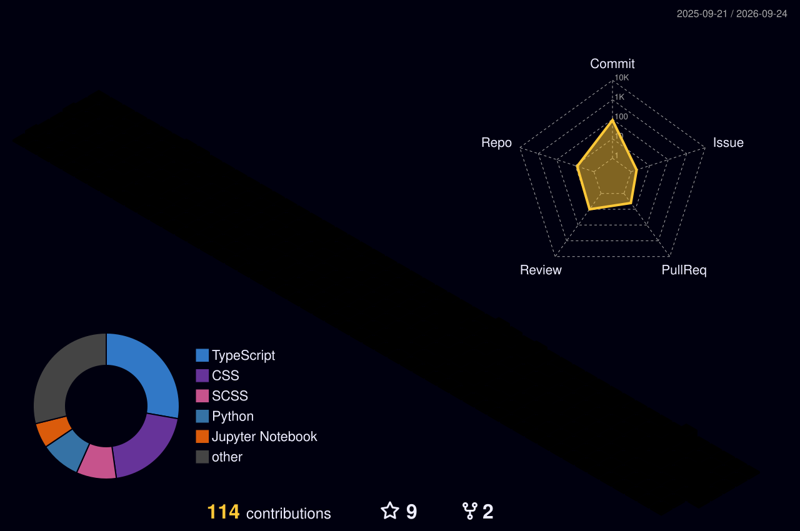

<!-- ====================================================== -->
<!--                    HEADER ANIMADO                      -->
<!-- ====================================================== -->

  

<!-- ====================================================== -->
<!--                    APRESENTAÇÃO                        -->
<!-- ====================================================== -->

  

  

    <strong>Desenvolvedor Web Frontend</strong> apaixonado por tecnologia,
    interfaces modernas e soluções digitais eficientes.
  

  

    
    
    
  

 

<!-- ====================================================== -->
<!--                       SOBRE MIM                         -->
<!-- ====================================================== -->

## 👨‍💻 Sobre mim

- 🌐 Desenvolvedor focado em aplicações web e interfaces responsivas;
- 🎨 Interessado em UI, UX e experiências digitais intuitivas;
- 🚀 Sempre estudando novas tecnologias e boas práticas;
- 🧠 Buscando transformar ideias em projetos funcionais;
- 📚 Atualmente estudando **Angular**;
- 💬 Aberto para aprender, colaborar e participar de novos projetos.

 

<!-- ====================================================== -->
<!--                  ESTATÍSTICAS GITHUB                    -->
<!-- ====================================================== -->

## 📊 Estatísticas do GitHub

  

  

 

  

 

  

 

<!-- ====================================================== -->
<!--                  TECNOLOGIAS PRINCIPAIS                 -->
<!-- ====================================================== -->

## 🛠️ Tecnologias principais

  

 

## 🧰 Ferramentas

  

 

## 📚 Também conheço

  

 

## 📖 Estudando atualmente

  

 

<!-- ====================================================== -->
<!--                    PROJETOS                             -->
<!-- ====================================================== -->

## 🚀 Projetos em destaque

  

  

> Os cards de projetos estão apontando para o repositório principal e para um projeto de frontend genérico; ajuste os nomes reais quando quiser conectar trabalhos específicos.

 

<!-- ====================================================== -->
<!--                CONTRIBUIÇÕES 3D                        -->
<!-- ====================================================== -->

## 🧊 Contribuições em 3D

  

 

<!-- ====================================================== -->
<!--                  SNAKE CONTRIBUTIONS                    -->
<!-- ====================================================== -->

## 🐍 Minha atividade no GitHub

  <picture>
    <source
      media="(prefers-color-scheme: dark)"
      srcset="./dist/github-snake-dark.svg"
    />
    <source
      media="(prefers-color-scheme: light)"
      srcset="./dist/github-snake.svg"
    />
    
  </picture>

 

<!-- ====================================================== -->
<!--                    REDES SOCIAIS                        -->
<!-- ====================================================== -->

## 🌐 Vamos nos conectar?

  

  

  

  

 

<!-- ====================================================== -->
<!--                      CONTATO                            -->
<!-- ====================================================== -->

## 📩 Contato

  

 

<!-- ====================================================== -->
<!--                    RODAPÉ                               -->
<!-- ====================================================== -->

  

    

  

